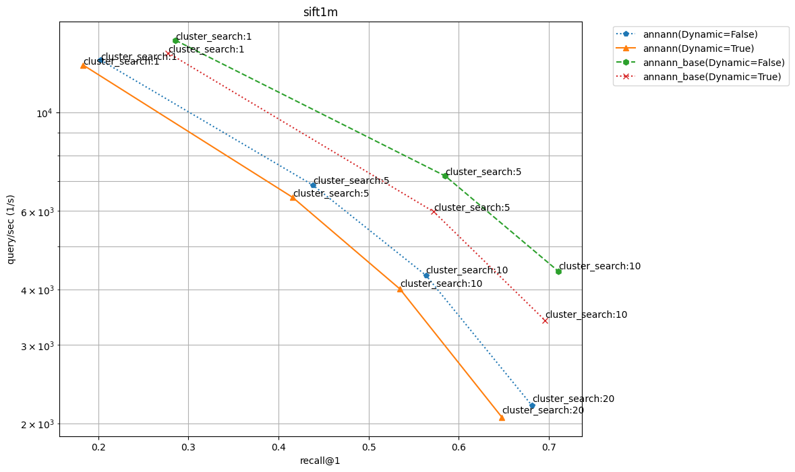

# ANNANN
An Approximate Nearest Neighbour algorithm utilizing an Artificial Neural Network for dimension reduction (also sounds funny and highlights its annying that these two abreviations are the same)

## Background
The original idea was to generate an index structure for an ANN algorithm that utilizes the general patterns of the individual dataset as a feature for better placement, search, and memory optimization. I believed it could solve issues related to scaling indexes for large datasets, toghether with problems related to decreasing recall for streaming tasks. The theory was that generating an index structure based on patterns in the dataset rather than a random distribution would make the structure itself more relevant even after heavy modification of the dataset. This asumes that entries in the dataset are somewhat correlated over time. 

## Implementation
The specific implementation used was simply created through trial and error. I had little previus information about KNN algorithms, however I knew I had to work within some constraints. Mainly that I wanted to make simple deletions and instertions simple, without having to alter the index structure. Secondly I also wanted to make it scalable, possible through dimension reduction but also beeing able to store large amounts of the index on disk. 

### Training
The end result was an algorithm utiling an autoencoder for a learned dimensionality reduction. It is trained over two stages, where the first simply learns the embedded space, and the second adds clustering information. A KMeans or MiniBatchKMeans is used to cluster within the embedded space, and these clusters are used as a reference during the second stage to better place entries within the clusters. This is baced on DEC, which stands for deep embedded clustering an is a known method to create a better embedded space for clustering.

### Index generation
Use the clusters within the embedded space as a reference, and add each original vector within the batch corresponding to the closest cluster in the embedded space. Fit an existing ANN algorithm HNSW to the cluster centroids, for fast cluster lookup.

### Querying 
Three main stages
1. Compute the embedded representations of the query vectors, and use HNSW to find C*10 closest embedded clusters.
2. Use linear scan for the C*10 closest embedded clusters to find the C closest in the original space
3. Use lineare scan over all C clusters to find the k closest neighbours

#### Mark*
The current implementation does not utilize disk storage for clusters, as this was only meant as a theoretical feature for future implementations

## Results

### Benchmark
As the algorithm is written in Python, even with as much tensorflow and numpy optimization as possible, the implementation language could still affect the results. Therefore benchmarking it against other more optimized algorithms would be meaningless. Instead a similar benchmark algorithm was constructed wich utilizes the same index generation and querying over the first and second step, only n the original space not an embedded. This would better show the differences in search resulting from a learned vector space.

### TODO

